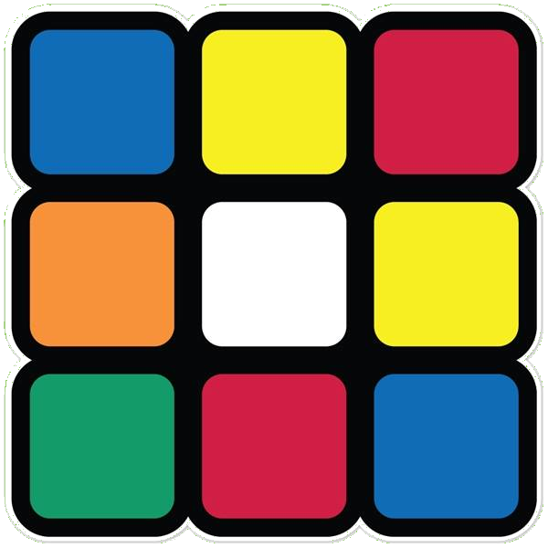
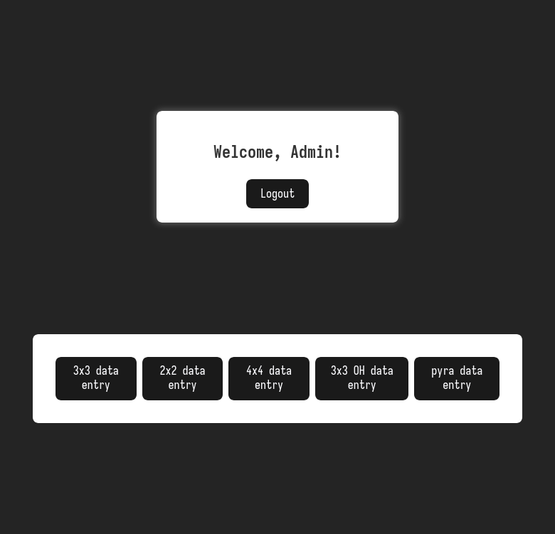
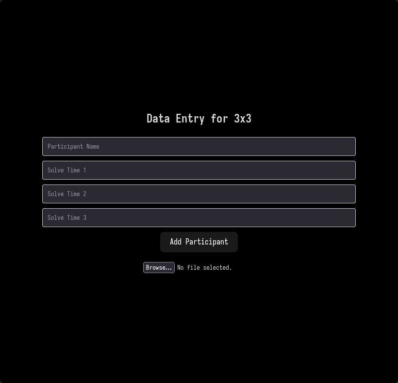
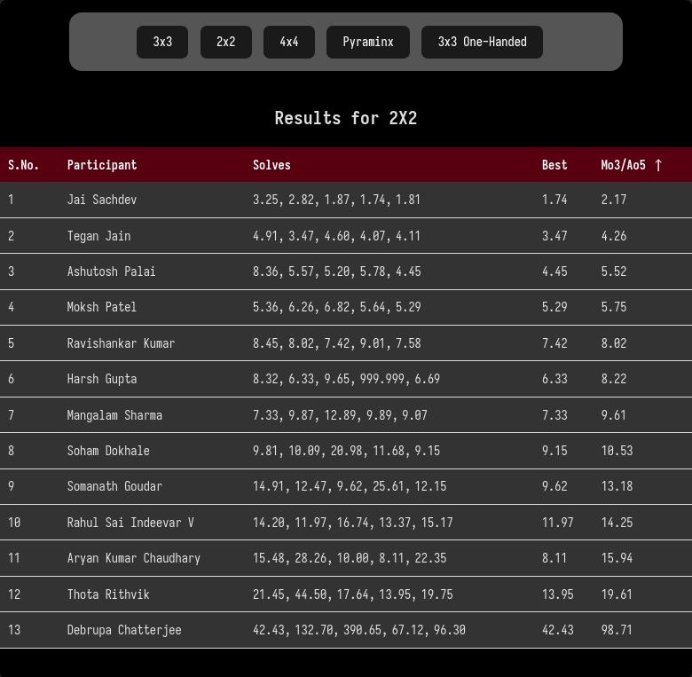

<!-- Improved compatibility of back to top link: See: https://github.com/othneildrew/Best-README-Template/pull/73 -->
<a id="readme-top"></a>
<!--
*** Thanks for checking out the Best-README-Template. If you have a suggestion
*** that would make this better, please fork the repo and create a pull request
*** or simply open an issue with the tag "enhancement".
*** Don't forget to give the project a star!
*** Thanks again! Now go create something AMAZING! :D
-->


<!-- PROJECT SHIELDS -->
<!--
*** I'm using markdown "reference style" links for readability.
*** Reference links are enclosed in brackets [ ] instead of parentheses ( ).
*** See the bottom of this document for the declaration of the reference variables
*** for contributors-url, forks-url, etc. This is an optional, concise syntax you may use.
*** https://www.markdownguide.org/basic-syntax/#reference-style-links
-->
[![Contributors][contributors-shield]][contributors-url]
[![Forks][forks-shield]][forks-url]
[![Stargazers][stars-shield]][stars-url]
[![Issues][issues-shield]][issues-url]

<!-- PROJECT LOGO -->
<br />
<div align="center">
  <a href="https://github.com/KGP-Speedcubers/live-results">
    
  </a>

  <h3 align="center">LiveScore</h3>

  <p align="center">
    Share the results of an Unofficial Cubing Competition Live
    <br />
    <a href="https://github.com/KGP-Speedcubers/live-results">No demo yet</a>
    ·
    <a href="https://github.com/KGP-Speedcubers/live-results/issues/new?labels=bug&template=bug-report---.md">Report Bug</a>
    ·
    <a href="https://github.com/KGP-Speedcubers/live-results/issues/new?labels=enhancement&template=feature-request---.md">Request Feature</a>
  </p>
</div>


<!-- TABLE OF CONTENTS -->
<details>
  <summary>Table of Contents</summary>
  <ol>
    <li>
      <a href="#about-the-project">About The Project</a>
      <ul>
        <li><a href="#built-with">Built With</a></li>
      </ul>
    </li>
    <li>
      <a href="#getting-started">Getting Started</a>
      <ul>
        <li><a href="#prerequisites">Prerequisites</a></li>
        <li><a href="#installation">Installation</a></li>
      </ul>
    </li>
    <li><a href="#usage">Usage</a></li>
    <li><a href="#roadmap">Roadmap</a></li>
    <li><a href="#contributing">Contributing</a></li>
    <li><a href="#contact">Contact</a></li>
    <li><a href="#acknowledgments">Acknowledgments</a></li>
  </ol>
</details>


<!-- ABOUT THE PROJECT -->
## About The Project

Results are a crucial part of cubing competitions. They can define whether or not someone 
advances to the next rounds, or what prices they win. I hated using spreadsheets
for this and [WCA Live](https://live.worldcubeassociation.org/) doesn't support
unofficial competitions. 

Also since cubing competitions happen in KGP we don't really even need to deploy this anywhere, 
we can just expose it on the local network. 

Livescore is designed to 
- Allow for easy data entry
- Let others view their results

There's a lot of enhancements that can be added, but these are the design principles

<p align="right">(<a href="#readme-top">back to top</a>)</p>


### Built With

* [![React][React.js]][React-url]
* [![Vite][Vite]][Vite-url]
* [![TypeScript][TypeScript]][TypeScript-url]
* [![Express][Express]][Express-url]
* [![SQLite][SQLite]][SQLite-url]

<p align="right">(<a href="#readme-top">back to top</a>)</p>


<!-- GETTING STARTED -->
## Getting Started

To get a local copy up and running follow these simple example steps.

### Prerequisites

> First get an idea of what cubing competitions are like. You can read [this](https://docs.google.com/document/d/1ApM7HCa9DnJVZYJqFS2xz5ZlW6sSQiF2gRAkypDoNhY/edit?tab=t.0)
and follow any of the given resources

* make sure you have `pnpm` installed. On Arch Linux
  ```sh
  sudo pacman -S pnpm
  ```


### Installation

* install dependencies and set up backend
  ```sh
  cd backend/
  pnpm install
  node server.js
  ```
* same for frontend
  ```sh
  cd frontend/
  pnpm install
  pnpm run dev
  ```

<p align="right">(<a href="#readme-top">back to top</a>)</p>


<!-- USAGE EXAMPLES -->
## Usage

<div style="display: flex; justify-content: space-around; align-items: center;">

  <div style="margin: 10px;">
    
  </div>

  <div style="margin: 10px;">
    
  </div>

  <div style="margin: 10px;">
    
  </div>

</div>

<p align="right">(<a href="#readme-top">back to top</a>)</p>


<!-- ROADMAP -->
## Roadmap

- [ ] Fix Import from csv
- [ ] Containerise Project
- [ ] Add frontend README
- [ ] Add Backend README
- [ ] Add Authentication for backend request
  * this might be unnescary after containerisation though
- [ ] Add CRUD operations to the Database
- [ ] Add more tables for participants, just name isn't enough
- [ ] Improve styling
  * ugly rn :(
- [ ] Move backend from `npm` to `pnpm` and add a `.gitignore`

See the [open issues](https://github.com/KGP-Speedcubers/live-results/issues) for a full list of proposed features (and known issues).

<p align="right">(<a href="#readme-top">back to top</a>)</p>


<!-- CONTRIBUTING -->
## Contributing

Contributions are what make the open source community such an amazing place to learn, inspire, and create. Any contributions you make are **greatly appreciated**.

If you have a suggestion that would make this better, please fork the repo and create a pull request. You can also simply open an issue with the tag "enhancement".
Don't forget to give the project a star! Thanks again!

1. Fork the Project
2. Create your Feature Branch (`git checkout -b feature/AmazingFeature`)
3. Commit your Changes (`git commit -m 'Add some AmazingFeature'`)
4. Push to the Branch (`git push origin feature/AmazingFeature`)
5. Open a Pull Request

### Top contributors:

<a href="https://github.com/KGP-Speedcubers/live-results/graphs/contributors">
  
</a>

<p align="right">(<a href="#readme-top">back to top</a>)</p>

<!-- CONTACT -->
## Contact

* Project Link: [https://github.com/KGP-Speedcubers/live-results](https://github.com/KGP-Speedcubers/live-results)
* Discord Server: [https://discord.gg/KQdGdB93Uc](https://discord.gg/KQdGdB93Uc)
  * join the `#livescore` channel

<p align="right">(<a href="#readme-top">back to top</a>)</p>


<!-- ACKNOWLEDGMENTS -->
## Acknowledgments

Use this space to list resources you find helpful and would like to give credit to. I've included a few of my favorites to kick things off!

* [Best-README-Template](https://github.com/othneildrew/Best-README-Template)
* [Malven's Flexbox Cheatsheet](https://flexbox.malven.co/)
* [Malven's Grid Cheatsheet](https://grid.malven.co/)
* [Img Shields](https://shields.io)
* [React Icons](https://react-icons.github.io/react-icons/search)

<p align="right">(<a href="#readme-top">back to top</a>)</p>


<!-- MARKDOWN LINKS & IMAGES -->
<!-- https://www.markdownguide.org/basic-syntax/#reference-style-links -->
[contributors-shield]: https://img.shields.io/github/contributors/KGP-Speedcubers/live-results.svg?style=for-the-badge
[contributors-url]: https://github.com/KGP-Speedcubers/live-results/graphs/contributors
[forks-shield]: https://img.shields.io/github/forks/KGP-Speedcubers/live-results.svg?style=for-the-badge
[forks-url]: https://github.com/KGP-Speedcubers/live-results/network/members
[stars-shield]: https://img.shields.io/github/stars/KGP-Speedcubers/live-results.svg?style=for-the-badge
[stars-url]: https://github.com/KGP-Speedcubers/live-results/stargazers
[issues-shield]: https://img.shields.io/github/issues/KGP-Speedcubers/live-results.svg?style=for-the-badge
[issues-url]: https://github.com/KGP-Speedcubers/live-results/issues
[license-shield]: https://img.shields.io/github/license/KGP-Speedcubers/live-results.svg?style=for-the-badge
[license-url]: https://github.com/KGP-Speedcubers/live-results/blob/master/LICENSE.txt
[linkedin-shield]: https://img.shields.io/badge/-LinkedIn-black.svg?style=for-the-badge&logo=linkedin&colorB=555
[linkedin-url]: https://linkedin.com/in/KGP-Speedcubers
[product-screenshot]: images/screenshot.png
[React.js]: https://img.shields.io/badge/React-20232A?style=for-the-badge&logo=react&logoColor=61DAFB
[React-url]: https://reactjs.org/
[Vite]: https://img.shields.io/badge/Vite-646CFF?style=for-the-badge&logo=vite&logoColor=FFFFFF
[Vite-url]: https://vite.dev/
[TypeScript]: https://img.shields.io/badge/TypeScript-007ACC?style=for-the-badge&logo=typescript&logoColor=white
[TypeScript-url]: https://www.typescriptlang.org/
[SQLite]: https://img.shields.io/badge/SQLite-003B57?style=for-the-badge&logo=sqlite&logoColor=white
[SQLite-url]: https://www.sqlite.org
[Express]: https://img.shields.io/badge/Express-404D59?style=for-the-badge&logo=express&logoColor=white
[Express-url]: https://expressjs.com//
